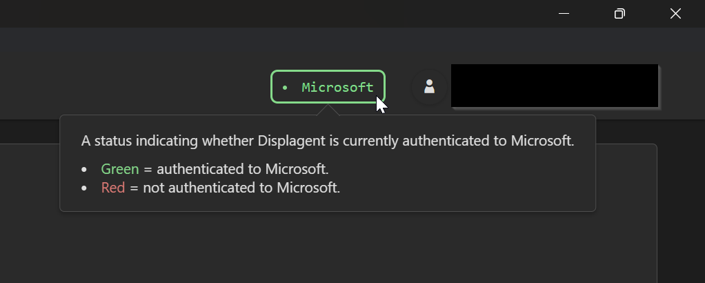

# Microsoft Integration

In order for you to get any value out of Displagent, it must first be able to authenticate you to your Microsoft tenant and read your Power BI metadata. In order for Displagent to do this successfully, you are required to choose a Microsoft Integration method.

I am **very pleased** to say that Microsoft now offers two different types of Microsoft Integrations:
* Standard Integration
* Advanced Integration

## Why Two Integrations?

Initially, Displagent *only* offered the Advanced Integration. However, this type of integration presented two glaring problems for users:

1. The setup was quite complex and involved manipulating Azure resources. This would likely prove very difficult for non-technical users, and sometimes getting the IT department involved is not a timely or easy ask.
2. The Advanced Integration **does not support multi-factor authentication**. I learned that this was a **major** issue for some companies using Power BI, where an MFA-exempt service account was not allowed.

## Which Is Better?

So far, for all of the functionality that Displagent offers, *both* integration types are perfectly fine to use. Each has its own advantages and disadvantages.

However, **I would recommend going with the Standard Integration** for the following reasons:
* It supports multi-factor authentication (MFA).
* It requires far fewer steps to setup.
* The guide is shorter and easier to read.
* You still get roughly the same benefits that you would with the Advanced Integration.

Nonetheless, for your convenience or curiosity, I have provided a full [comparison table](#compare-integrations) below along with links to the dedicated guides for each type of integration.

::: warning Read the guide
Whichever integration that you pick, please read its dedicated guide. Remember, *for you to get any value from Displagent*, it needs to successfully authenticate you to Microsoft first.
:::

### Legacy Users

If you became a Displagent customer before February 2024, then you are already setup using the Advanced Integration. You are perfectly fine to continue using this integration for as long as you would like. However, you are welcome to switch over to the Standard Integration at your leisure.

## Local Encryption

One of the main reasons that I changed Displagent from a web app initially to a desktop app was so that you can securely store your sensitive Microsoft credentials **on your local machine** *and* **in an encrypted state**.

Regardless of which type of Microsoft Integration you choose, Displagent keeps a small cache on your machine to persist and automate the Microsoft authentication process.

However, this cache is encrypted and stored *on your local machine only*. Displagent **does not** store any of this information in its backend, anywhere.

::: tip
And in fact, for the Standard Integration, it is *impossible* for Displagent to access your credentials even if it wanted to because it uses the official Microsoft Authentication Library (MSAL).
:::

## Status Indicator

Inside of Displagent itself, I have added a convenient status indicator to quickly show you whether or not you are authenticated to Microsoft. You can find it in the upper right-hand corner, next to your username.

## Compare Integrations

| Name | Difficulty | Guide | Supports MFA | Possible Timeouts | Azure Secret Expirys | Local Encryption |
| :---: | :---: | :---: | :---: | :---: | :---: | :---: |
| Standard (recommended) | Easy | [Read Guide](/setup/standard-integration) | Yes | Yes | N/A | Yes |
| Advanced | Medium | [Read Guide](/setup/advanced-integration) | No | No | Yes | Yes |