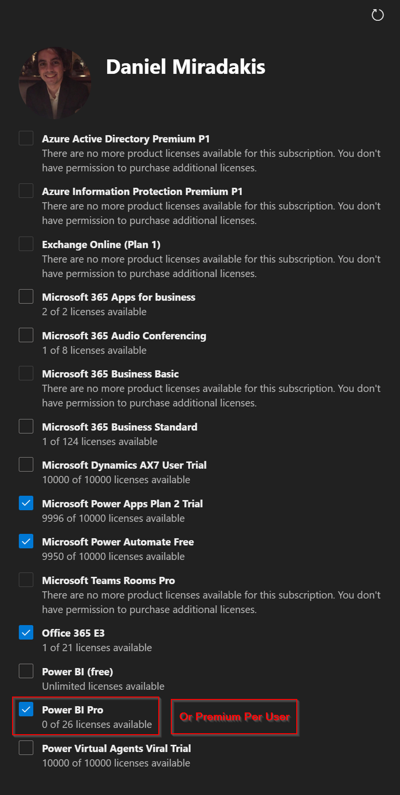

# Power BI Service Account

This document outlines a step-by-step guide on how to provision a Power BI service account in your company's [Azure Active Directory](https://portal.azure.com/#view/Microsoft_AAD_UsersAndTenants/UserManagementMenuBlade/~/AllUsers).

## Intro

If you do not currently have one, please provision a Power BI service account for Displagent.

I have provided some useful links on this page for you to easily navigate to the appropriate pages in your company's Azure tenant, Microsft 365 admin area, and Power BI Service:
* [Microsoft 365 Admin Portal](https://portal.office.com/AdminPortal/Home#/users)
* [Azure Active Directory](https://portal.azure.com/#view/Microsoft_AAD_UsersAndTenants/UserManagementMenuBlade/~/AllUsers)
* [Power BI Service](https://app.powerbi.com/home)

::: tip Password Expiry
If possible, it would be beneficial to set a non-expirying password for the service account. Should the password change, you will need to come back through your Displagent installations and update this value.
:::

::: danger Multi-factor Authentication Reminder
If the Power BI serivce account that you choose to use requires multi-factor authentication, Displagent will NOT be able to authenticate you to Microsoft and the entire app will not work. Unfortunately, this is not a limitation of Displagent but rather [a limitation within Microsoft's authentication platform](https://learn.microsoft.com/en-us/azure/active-directory/develop/v2-oauth-ropc).
:::

## Microsft 365 Admin Portal

### Licensing

Please ensure that the service/master account has either a Power BI Pro or Power BI Premium Per User license assigned to it.

::: tip Recall
In general, an easy rule of thumb is to give your service account the same license type that your other Power BI users have. At the end of the day, what matters most is knowing whether or not your content resides in a dedicated workspace. If it does not, a Power BI Pro license will probably do the job.
:::

### Roles

While it is not necessary, it is convenient to assign your service account the `Power BI Administrator` role.

## Power BI Service

Please ensure that your service account has at least `View` permissions in the Power BI workspaces where your Power BI content resides.

Additionally, if your Power BI content is linked to **shared datasets** that reside in separate workspaces, please ensure that your service account has at least `Read` access to those datasets or their encapsulating workspaces in the Power BI service.

::: danger My workspace
Any application that uses the Power BI REST API - such as Displagent - is *not able* to access content from `My workspace`, and that goes for all users. Please ensure that your Power BI content you wish to display **is NOT located in `My workspace`**.
:::